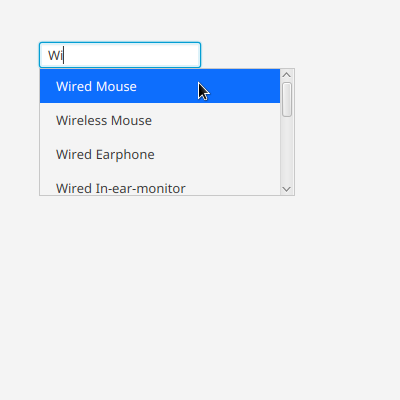

# JavaFX Auto-complete Sample
This project is like a template or a guidance for you and me to get the idea how to implement auto-completion in JavaFX.

It utilizes 
`javafx.scene.control.Label`, 
`javafx.scene.control.ScrollPane`, 
`javafx.scene.control.TextField`, and 
`javafx.scene.layout.VBox`.

Of course, the logic of searching data could be improved, as this is just for a reference purpose.
**Please enjoy :smile:**

## Prerequisites
- Java 11
- Maven

## Installation
1. Please make sure your **Java** is already being set to **11**
2. Run `mvn clean javafx:run`

## Screenshots

